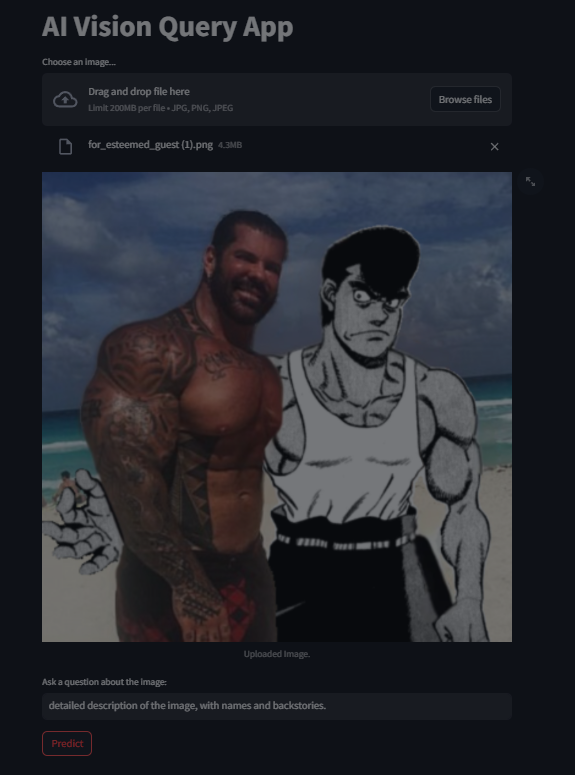

# AI Vision Query App

## Overview
The AI Vision Query App leverages the powerful Llama 3 vision model enhanced by SigLIP capabilities for interactive, image-based question answering. Built with Streamlit, this tool enables users to upload images and inquire about their content, receiving answers directly from the AI.

## Installation

Ensure your system has Python and CUDA installed for PyTorch and GPU support. Install all necessary Python packages using:

```
pip install torch torchvision transformers pillow streamlit
```

## Usage

To run the app, navigate to your project directory in the terminal and execute:

```
streamlit run app.py
```

Access the app by visiting 'localhost:8501' in your web browser. Upload an image and type a question related to the image, and the model will analyze the image to provide an answer.

### Example Code

Below is a sample code snippet demonstrating how the model processes an image and a related question:

```
from PIL import Image
from transformers import AutoModelForCausalLM, AutoTokenizer

model_id = "qresearch/llama-3-vision-alpha-hf"
model = AutoModelForCausalLM.from_pretrained(model_id, trust_remote_code=True, torch_dtype=torch.float16).to("cuda")
tokenizer = AutoTokenizer.from_pretrained(model_id)

# Load an image
image = Image.open("image_path")

# Example question
question = "What is in this image?"

# Decode the answer from the model
print(tokenizer.decode(model.answer_question(image, question, tokenizer), skip_special_tokens=True))
```

## Built With
- **Python** - Primary programming language.
- **PyTorch** - For model operations.
- **Transformers** - To utilize the Llama 3 model easily.
- **Pillow** - For handling image processing.
- **Streamlit** - To create the interactive web interface.

## Example


## Authors
- **@yeswondwerr** - Initial development and model integration.
- **@qtnx_** - Enhancements and additional features.

## Acknowledgments
Special thanks to the open-source community and the contributors of the Llama 3 model for making sophisticated AI tools accessible to a broader audience.
